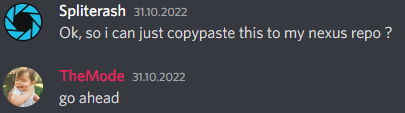

# Minestom Event System

Event system taken out of [Minestom](https://github.com/Minestom/Minestom).

I really liked working with events in [minestom](https://github.com/Minestom/Minestom), and I wanted to use it for bukkit plugins, as well as non-minecraft
projects, so i just copypaste it



If you want use it

Gradle:
```kotlin
repositories {
    maven("https://nexus.spliterash.ru/repository/group/")
}

dependencies {
    implementation("ru.spliterash:minestom-event-core:1.0.0")
}
```